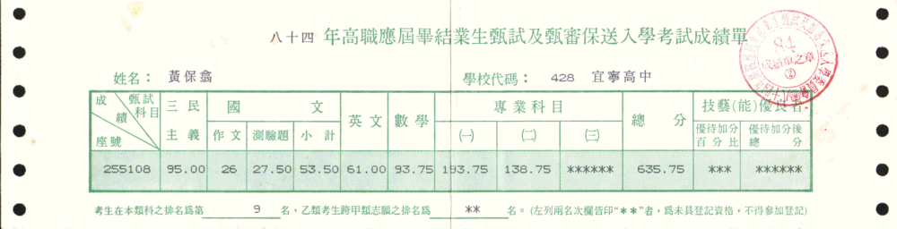

# 發現與培育專注能力

**我在高中時期，花上兩年的時間，培育出自己的專注能力，體會到分享知識換來的是對知識更深入的理解，這些都是一輩子受益的寶藏。**

   

國中時期，曾經有個物理老師對我們班說過一席話，我一直到現在還是牢牢記得，老師說：「人的一生中最重要的就是國中與高中時期，只要你們這時候不讀書，高中也不太可能讀書讀得好，更別想考到什麼好大學，考不到好大學，這輩子也就完了。」沒錯，老師話說得很重，我聽得很痛，但我不能反駁些甚麼，一來我不是 A 段班本來就沒啥自信，二來自己本來就沒啥在讀書自己對號入座，三來老師是名校畢業說話好像很有道理，這席話，深深地烙印在我心中。

 國中畢業前夕，幸運的我已經深知自己的興趣與志向，心中只有一個選擇，就是朝「資訊」相關科系就讀，所以我當時放棄了高中與五專聯考的機會，直接報考高職聯招而已，可見當時心意如此堅定，放棄了所有其他求學路徑。可惜我在國中之前從來沒認真讀過書，家裡也沒真的逼我唸過甚麼書，高職聯考結束，如預期的得到不太好的成績，但我的目標卻只放在「非資訊科不讀」，當時可以選擇的學校並不多。好在有個國中同學提到有間私立高中可以直接拿成績單去報到，問我要不要一起去，我只問了一句：「他們有沒有資訊科」，他說：「有」，我就拿著不太好看的成績單報到去了。

 跟著國中同學與他的家人一起晃到了學校後，教務處人員問我說：「你要讀哪一科？」我說：「我的成績可以讀資訊科嗎？」，她說：「你考幾分？」我說：「372」，她說：「喔，成績不錯啊，把你分配到資優班喔？」，我雀躍的說：「好啊！」，我就這樣正式踏入我的高職生活。

 後來我連「聯招分發」都沒去，因為我根本不需要分發，我已經找到學校收我了，還真是幸運。接下來兩個月的就學空窗期，就跟著父親一起去他上班的木工廠打工，每天就帶著口罩不斷的切木頭，重複的工作真的很無趣，就算最後領到薪水一點也不覺得開心，心想自己未來一定不要從事這種工作。當時爸爸跟我說：「你以後如果不想做苦工，就應該現在開始讀書。」我有聽進去，也覺得有道理，但真的沒有什麼施力點，讀書實在也很沒趣，就這樣不了了之了。

 剛上高職後，心情上還有點緊張，我在就學後第一次段考有比國中時期還認真一點點，有在回家後多複習一點課業，那次的考試意外的考到全科系第三名的成績，這是我連作夢都不敢想的成績耶，第一次覺得原來讀書這麼容易！過沒多久，第二次段考的成績已達全科系第一名，我當時簡直 High 翻了，有種光宗耀祖的感覺，哈！後來幾乎每次都考前三名，我後來想，我就讀的高職確實沒有很好，學校並沒有甚麼讀書風氣，我自覺這樣下去根本不可能考到甚麼好的大學，到了高二開始決心去補習，為之後的升學計劃做好準備。

 從高二到高三的時間，我為了升學，我把我最心愛的電腦賣了，所有配備都賣，不留後路。不過最氣的事，我賣給一個同校不同班的同學，他只付給我頭期款，尾款還沒收到人就轉學了！ >"<

 接下來兩年的時間，我還搬離家裡住在學校附近 (因為當時通車上學一天要花上兩個多小時)，幾乎都把時間花在補習與讀書上，只要是放學的時間，就是補習上課，只要補習班下課就是不斷讀書、做習題，每天有紀律的讀書到 2:00 睡覺，早上 7:00 起床，然後在學校整天有一半的時間都在睡，真的不誇張，尤其是高三的生活，學校老師還把我安排在獨立的座位，讓我盡量不要影響到其他同學。

 這段時間，外人看來真的非常辛苦，對我來說，支持我堅持下去的理由，在當下應該是「我以後不要做苦工」，但現在回想起來，真的理由應該是「學習所獲得的成就感」，這應該才是支持我每天有紀律讀書的最佳解答。這段時間，由於我非常專注，目標也非常明確，就是「考上一間好學校」，每天不管別人讀甚麼書、讀的好不好，我從不比較，我只在乎自己每天是否有進步，我未來大學聯考的假想敵只有一個，就是「全世界最強的人」，不是我的同校同學、不是我的補習班同學，而是一個假想的天才，我跟身邊的人沒甚麼好比的，唯一能比的就是自己，自己有沒有進步，才是最終的決勝關鍵！

 在補習班裡，我所就讀的學校算是班上的少數，我們一班有三百多人，大概有兩百多人都是台中高工的同學，那是中區高職院校第一志願，同學各個都非常聰明，但他們來補習卻遇到一個我從來不曾遇過的問題，就是台中高工很少有同學願意無私地分享自己學會的東西，他們把自己的同學視為假想敵。而我，從來不把同學當敵人，由於我學習的很好，我從課堂上學會的東西，只要有人問我，我都大方回答，還逐步教導問我的同學如何解答，每次講解完畢，我總能感受到更深層的體會，對問題的理解程度也越來越高，當下就已經得到一個人生道理：「願意分享的人，收穫最多的永遠是自己。」

 由於我高二開始已經不太讀自己學校的書，只讀補習班的教材，補習班的教學進度遠遠超前學校所學，因此在校成績並不算差，前幾名還是有的，但要拿第一名就很難了，因為教學的進步並不相同。從高三開始，學校共有六次大學模擬考，我在高二結束時，補習班學習的內容已經把高職三年要學的都教完了，所以就學習的完整度來說，我已經是可以參加模擬考的狀態，所以我每次模擬考都是全校第一，而且永遠都高出段考全校第一名的同學一百多分，這成績讓老師與同學都覺得不可思議，我到覺得是理所當然，因為我都學完了阿。

 人生的大挑戰即將來臨，準備面對殘酷的廝殺，我報考了保送甄試，這是全台各職挑出各校前 10 名的資優生參加的考試競賽，跟大學聯招有點像，只在於報考的人有資格限制而已，只要考上了學校就不用再參加聯招考試，考不上的話，還能再次參加聯招考試，對我來說算是個不錯的機會。考完之後，自覺考得不錯，但會上甚麼學校沒啥信心，心裡只想著應該有「公立技術學院」可讀吧，其他就聽天由命，不敢多想。回到學校後還有好幾周的時間不知道考試結果，是要繼續努力接下來的聯招考試？還是有學校就去讀呢？這段時間還真有點掙扎，但多少讀一點還是會的，至少會多與同學分享所知所學。

 接著成績單寄到了學校，不是寄給我，是寄給學校，我被教務主任叫去訪談，他問我說：「你覺得你考得怎樣？」我說：「應該還可以吧」，他說：「你考得很好你知道嗎？你考全國第 9 名耶！我們學校創校 47 年來，沒人考的怎麼好過，你是怎麼讀書的？」天啊，我開心死了，全國第 9 名意味著我可以選讀任何一間技術學院，包括第一志願「國立台灣工業技術學院」。接著我回教務主任的話「我是靠補習班才考上的」我堅決地說著。

 還好當時有特別掃描成績單下來，不然現在也找不到那張紙了！ ^^

 這段時間，跟我的 IT 生崖看似沒啥關係，但是這段時間卻培養出自己的專注力，以及如何透過明確的目標設定帶來力量，我深刻地感受到專注帶來的優勢，也透徹的體會到分享知識所帶來的益處，這些都對我日後的 IT 發展帶來極大的益處。